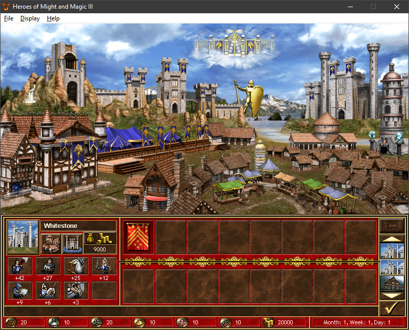
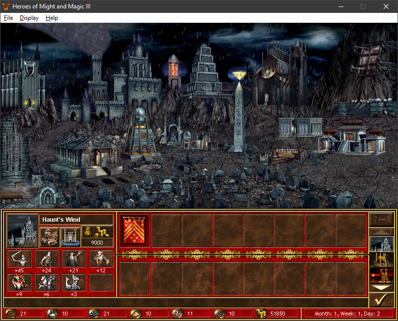
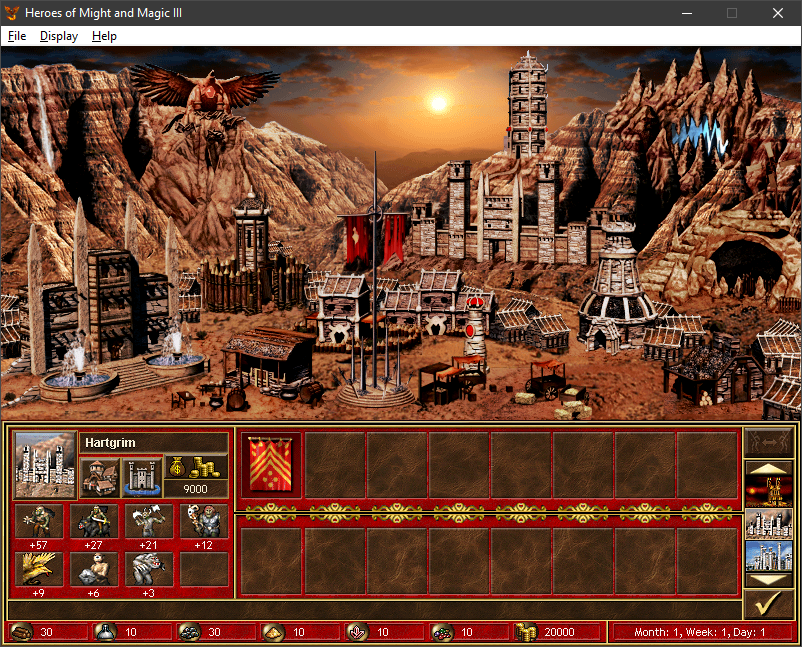

### Mod: **Towns of Day and Night**
> [!TIP]
> You can add graphics to this mod yourself [Modification Guide](#Modification)
---

#### **Overview**

"Towns of Day and Night" brings a whole new level of immersion and realism to **Heroes of Might and Magic III**. With this mod, the cities in your game will dynamically change their appearance depending on the time of day. Whether you're watching the sun rise over a serene Rampart or observing the mysterious twilight descending upon a Necropolis, each town will offer a visually distinct experience that deepens your connection with the world

---

#### **Features**

- **Dynamic Time of Day Visuals**: Towns now shift in appearance as time passes, showcasing beautiful transitions between **dawn**, **daylight**, **dusk**, and **night**.
  
- **Unique Atmospheres for Each Town Type**: Every town type has its own carefully crafted day and night visuals, enhancing their inherent characteristics:
  - **Castles** gleam in the radiant sunlight and take on a warm glow at dusk.
  - **Necropolises** grow darker and more eerie as night falls, shrouded in mystery.
  - **Towers** reflect the changing hues of the sky, from the clear morning to the twilight stars.
  
- **Immersive World-Building**: Experience the game like never before, where each visit to a town feels alive and reactive to the passage of time. Explore cities at dawn with the promise of adventure, or prepare for night-time challenges as the shadows deepen.

- **Seamless Transitions**: The visual changes between times of day are smooth and natural, designed to preserve the aesthetic integrity of the original game while enhancing its atmosphere.

---
#### **Screenshots**

- **Morning in Castle**  
  

- **Night in Necropolis**  
  

- **Dusk in Stronghold**  
  

---

#### **Why This Mod?**

**Heroes III** has long been a favorite for its rich strategy and fantasy elements, but this mod adds a new layer of life to the game. Instead of static town screens, you’ll now get a world that feels more alive and responsive to the time of day. Whether you're building your kingdom under the bright sun or defending your citadel under the cover of darkness, "Towns of Day and Night" offers an unforgettable enhancement to your gameplay.

---

#### **Credits**

- **Idea and Artwork**: **FanOfHeroes**
- **Code and Plugin Development**: **daemon_n**

This mod was made possible thanks to the creative vision of FanOfHeroes and the technical expertise of daemon_n
---

## Modification

You can also change/add graphics not only for any of the standard 9 cities, but also for new cities that can be added to the game by other mods:
> [!IMPORTANT]
> You can (and I, daemon_n, recommend) place your graphics in the archives of other mods, so that when updating this mod, you do not lose the changes you made;

### Adding/Changing a static city background
- create a background image in the "png" format and 800x374 in size;
- name it according to the city prefix, adding "time of day" to the file name using the template "[prefix]_[time]BG.png":
```
for example, an image for time "0" and the city "Citadel" will be called "TBSt_0BG.png";
```
- place the image in your zip file (this mod uses [data/todan_pcx.zip](data/todan_pcx.zip)) in the subfolder "data/pcx/[townName]", where "townName" is the name of the city;

### Adding an animated background
- create a set of background images in the format "png" and the size 800x374;
- name according to the city prefix, adding the "time of day" and "index" of the frame to the file name using the template "[prefix]_[time][index].png":
```
for example, the 7th (counting from 0) image for the time "2" and the city "Tower" will be called "TBTW_27.png";
```
- place the images in your zip file (this mod uses [data/todan_pcx.zip](data/todan_pcx.zip)) in the subfolder "data/pcx/[townName]/animated", where "townName" is the name of the town;
> [!NOTE]
> It is important to name the files sequentially so that the animation plays all the frames, and after the last frame the image with index "0" is displayed again;

### Adding weather effects
- create a "def"-file-dummy with frames of size 800x374 and the number needed for your animation;
	- create the required number of frames in the "png" format and size 800x374, which will replace the dummy frames;
	- place the "def" inside any "pac"-file so that the game loads it;
	- place "png" files inside your zip file (this mod uses [data/todan_defs.zip](data/todan_defs.zip)) in the subfolder "defs/[defName.def]/", where [defName.def] is the name of your dummy "def" file;
	- Create a json key in your json file of any active mod in the subfolder "Lang" in the format:
	- "todan.animations.[prefix].[index]", where [prefix] is responsible for the unique prefix of each city, and [index] is for the time of day in which this animation will be used;
	> [!NOTE]
	> if you set [index] = "-1", then the weather effect will work at any time of day for this type of city;
	- write the name of the dummy "def" file in the value of the created key;
	- for example, the volcano animation in Inferno for time "1" is set like this:
	```
	{
	"todan": {
        "animations": {
            "TBIn": {
                "1": [
                    "volcano.def"
                ]
				}
			}
		}
	}
	```
	or simply ``"todan.animations.TBIn.1":"volcano.def"``;
	- you can set several weather animations for each city/time (up to 5 at the moment);
	- other examples can be found in the mod settings file: [Lang/todan_settings.json](Lang/todan_settings.json);

### Adding support for new cities:
- create the required number of frames in "png" format and the required size, which will replace the frames of the original buildings in the "0_[index].png" format, where [index] is responsible for the frame number of the building;
- create a json key in your json file of any active mod in the "Lang" subfolder in the format:
	```
	"todan.townTypeNames.[prefix]":"[townTypeName]";
	```
	where [prefix] is responsible for the unique prefix of the added city, and [townTypeName] is responsible for the name of the folder with buildings that are used to store png images to replace the original def files of buildings;
- place "png" files inside your zip file (this mod uses [data/todan_defs.zip](data/todan_defs.zip)) in the subfolder "defs/buildings/[townTypeName]/[time]/[buildingDefName.def]/", where:
	- [townTypeName] is the name of the folder that you specified in the item above;
	- [time] is the time of day for which the graphics replacement will work;
	- [buildingDefName.def] - the name of the def file of each building (they are the same everywhere) of the dummy "def" file;
	
## info
### List of standard town prefixes:
- "TBCs": "Castle"
- "TBDn": "Dungeon"
- "TBEl": "Conflux"
- "TBFr": "Fortress"
- "TBIn": "Inferno"
- "TBNc": "Necropolis"
- "TBRm": "Rampart"
- "TBSt": "Stronghold"
- "TBTw": "Tower"
